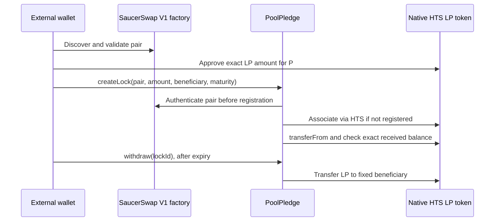

# Architecture and custody

PoolPledge is a testnet-only Next.js / Hardhat / npm-workspace template. It uses SaucerSwap V1 as a required protocol integration and Hedera native HTS association and token redirects for custody. No Harness integration is claimed.

## Trust boundaries

- `packages/core` holds independently authored minimal ABIs, canonical testnet configuration, pool validation and exact amount conversion. Deployment sources and retrieval dates live alongside the configuration. A valid pool identifies the canonical factory and is returned by that factory's `getPair(token0, token1)`. Its separate `lpToken()` address identifies the native HTS asset; the pair itself is not the token.
- `packages/hardhat/contracts/PoolPledge.sol` fixes the factory at construction. Registration validates the pool before HTS association at `0x167`. Deposits require a positive signed-64-bit-compatible amount, a valid beneficiary and a future release time no more than five years away. Exact incoming balance deltas prevent undercollateralized liabilities. State-changing entry points reject reentrancy.
- Each lock has an immutable beneficiary, amount and maturity. Only that beneficiary may withdraw, once, after maturity. Failed HTS codes or token transfers revert. There is no administrator, early unlock, fee, rescue function or upgrade proxy. Direct token transfers create no withdrawal rights and may be stranded. The UI calls the beneficiary the owner; it currently makes the connected depositor the beneficiary.
- `packages/nextjs` serves public read APIs and shareable `/locks/<id>` pages. RPC failures surface as errors. The injected external EVM wallet holds credentials and signs only after chain 296 enforcement. Approval and deposit are separate requests; exact allowance is checked again before deposit. A rejected deposit can leave an approval outstanding; inspect on-chain allowance before describing or revoking it. Pending hashes can be checked before retrying.
- CLI scripts alone load root `.env` / `.env.local`. The frontend imports public `lib/deployment.json` and the compiled ABI. Root `POOLPLEDGE_ADDRESS` does **not** configure the frontend. Never place a signing key in frontend source, a public environment variable, or a build configuration.

## Sequence

## Limits and operational risks

This code is unaudited. It proves custody and time enforcement, not the safety or value of underlying assets. Native token freeze, pause, deletion or other token-admin behavior can prevent transfers. Markets and testnet liquidity can change; testnet resets can invalidate deployments and evidence. A maturity timestamp does not automatically execute withdrawal: the beneficiary must submit a transaction and pay fees.

Only V1 pools and injected EVM wallets are supported. WalletConnect/HashPack-specific integrations, liquidity removal, production indexing and mainnet deployments are out of scope. Public RPC/mirror endpoints have availability and rate limits. UI mobile layout testing does not prove mobile-wallet signing.

Local HTS boundary mocks cover contract invariants but cannot prove native permissions or gas costs. The CLI evidence demonstrates one real acquisition/deposit/withdrawal cycle. It does not establish browser signing or a fresh public scaffold. The CLI budget guard counts saved local receipts, reserves 0.2 HBAR principal and enforces a 6.983 HBAR cumulative ceiling; deleting evidence bypasses its accounting and is prohibited. The browser does not enforce that CLI budget.

## Public configuration for a new deployment

After deployment, `deployments/296.json` contains the public address, factory, ABI and deployment hash. It is ignored to avoid accidentally publishing local run output. Manually copy only public fields into `packages/nextjs/lib/deployment.json`, and its `abi` into `PoolPledge.abi.json`. Set `verifiedLockId` only after your own completed lock cycle; do not copy the example's verification claims. Update the three example links in `app/layout.tsx`, `components/pool-workspace.tsx` and `app/test-wallet/page.tsx` if using a different lock ID, and remove the completed-example claims until your cycle succeeds. Run the validation commands again. The default `/locks/0` smoke assertions intentionally target the included example and must be updated for a different deployment.
